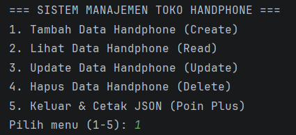
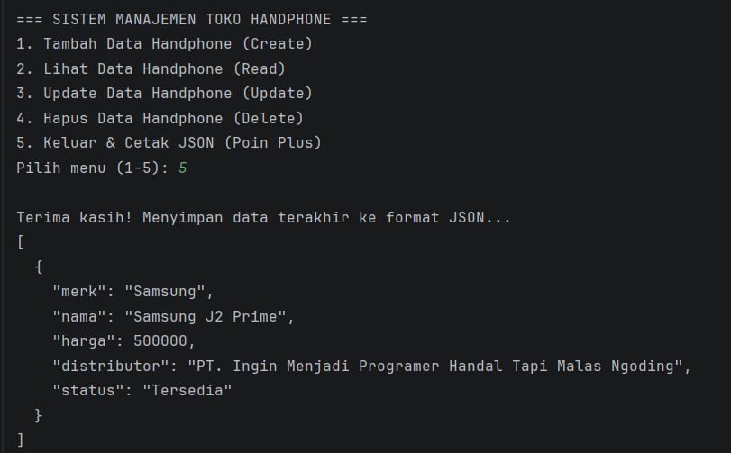

# Sistem Manajemen Toko Handphone 📱

## 1. Deskripsi Singkat Program
Sistem Manajemen Toko Handphone adalah sebuah program aplikasi berbasis konsol (CLI) yang ditulis menggunakan bahasa pemrograman Java. Program ini dibuat untuk menyimulasikan pengelolaan data barang di sebuah toko *handphone*, dengan menerapkan konsep dasar *Object-Oriented Programming* (OOP) seperti pembuatan *Class*, instansiasi *Object*, *Constructor Overloading*, serta penggunaan kata kunci `this`.

Pada versi Posttest 2 ini, program telah ditingkatkan secara terstruktur dan beralih menggunakan *build tool* **Maven** untuk manajemen proyek dan dependensi. Program ini mengimpor *package* dari luar modul, yaitu **Gson** buatan Google, untuk memanipulasi *output* `ArrayList` menjadi struktur data teks JSON saat program ditutup.

## 2. Code Program
Proyek ini menggunakan struktur direktori standar Maven. Berikut adalah *source code* dari masing-masing *file* penyusunnya:

### 2.1 pom.xml
```xml
<?xml version="1.0" encoding="UTF-8"?>
<project xmlns="http://maven.apache.org/POM/4.0.0"
         xmlns:xsi="http://www.w3.org/2001/XMLSchema-instance"
         xsi:schemaLocation="http://maven.apache.org/POM/4.0.0 http://maven.apache.org/xsd/maven-4.0.0.xsd">
    <modelVersion>4.0.0</modelVersion>

    <groupId>com.toko</groupId>
    <artifactId>Posttest2</artifactId>
    <version>1.0-SNAPSHOT</version>

    <dependencies>
        <dependency>
            <groupId>com.google.code.gson</groupId>
            <artifactId>gson</artifactId>
            <version>2.10.1</version>
        </dependency>
    </dependencies>

    <properties>
        <maven.compiler.source>21</maven.compiler.source>
        <maven.compiler.target>21</maven.compiler.target>
    </properties>
</project>
```

### 2.2 Handphone.java
```java
package org.example.models;

public class Handphone {

    // PRIVATE
    private String merk;
    private String nama;
    private int harga;

    // PROTECTED
    protected String distributor = "PT. Ingin Menjadi Programer Handal Tapi Malas Ngoding";

    // DEFAULT
    String status = "Tersedia";

    // PUBLIC
    public Handphone(String merk, String nama, int harga) {
        this.merk = merk;
        this.nama = nama;
        setHarga(harga);
    }

    // GETTER & SETTER

    public String getMerk() {
        return merk;
    }

    public void setMerk(String merk) {
        this.merk = merk;
    }

    public String getNama() {
        return nama;
    }

    public void setNama(String nama) {
        this.nama = nama;
    }

    public int getHarga() {
        return harga;
    }

    // Encapsulation
    public void setHarga(int harga) {
        if (harga < 0) {
            System.out.println("Peringatan: Harga tidak boleh negatif. Nilai di-set ke 0.");
            this.harga = 0;
        } else {
            this.harga = harga;
        }
    }

    // Method Public
    public void tampilkanData() {
        System.out.println("Merk: " + this.merk + " | Nama: " + this.nama +
                " | Harga: Rp" + this.harga +
                " | Distributor: " + this.distributor +
                " | Status: " + this.status);
    }
}
```

### 2.3 Main.java
```java
package org.example;
import org.example.models.Handphone;
import com.google.gson.Gson;      // package external (Gson)
import com.google.gson.GsonBuilder;
import java.util.ArrayList;
import java.util.Scanner;

public class Main {
    public static void main(String[] args) {
        Scanner scanner = new Scanner(System.in);
        ArrayList<Handphone> daftarHandphone = new ArrayList<>();
        boolean isRunning = true;

        while (isRunning) {
            System.out.println("\n=== SISTEM MANAJEMEN TOKO HANDPHONE ===");
            System.out.println("1. Tambah Data Handphone (Create)");
            System.out.println("2. Lihat Data Handphone (Read)");
            System.out.println("3. Update Data Handphone (Update)");
            System.out.println("4. Hapus Data Handphone (Delete)");
            System.out.println("5. Keluar & Cetak JSON (Poin Plus)");
            System.out.print("Pilih menu (1-5): ");

            int pilihan = scanner.nextInt();
            scanner.nextLine();

            switch (pilihan) {
                case 1:
                    System.out.print("Masukkan Merk Handphone: ");
                    String merkBaru = scanner.nextLine();
                    System.out.print("Masukkan Nama Handphone: ");
                    String namaBaru = scanner.nextLine();
                    System.out.print("Masukkan Harga Handphone: ");
                    int hargaBaru = scanner.nextInt();

                    Handphone hpBaru = new Handphone(merkBaru, namaBaru, hargaBaru);
                    daftarHandphone.add(hpBaru);
                    System.out.println("Data berhasil ditambahkan!");
                    break;

                case 2:
                    System.out.println("\n--- Daftar Handphone ---");
                    if (daftarHandphone.isEmpty()) {
                        System.out.println("Data masih kosong.");
                    } else {
                        for (int i = 0; i < daftarHandphone.size(); i++) {
                            System.out.print((i + 1) + ". ");
                                                            // Mengambil data menggunakan Getter
                            System.out.println("Merk: " + daftarHandphone.get(i).getMerk() + " | Nama: " + daftarHandphone.get(i).getNama()+ " | Harga: " + daftarHandphone.get(i).getHarga());
                        }
                    }
                    break;

                case 3:
                    System.out.println("\n--- Update Data Handphone ---");
                    if (daftarHandphone.isEmpty()) {
                        System.out.println("Data masih kosong.");
                    } else {
                        System.out.print("Masukkan nomor urut data yang ingin diubah: ");
                        int indexUpdate = scanner.nextInt() - 1;
                        scanner.nextLine();

                        if (indexUpdate >= 0 && indexUpdate < daftarHandphone.size()) {
                            Handphone hpTarget = daftarHandphone.get(indexUpdate);

                            System.out.print("Masukkan Merk Baru: ");
                                                            // Menimpa data menggunakan Setter
                            hpTarget.setMerk(scanner.nextLine());

                            System.out.print("Masukkan Nama Baru: ");
                            hpTarget.setNama(scanner.nextLine());

                            System.out.print("Masukkan Harga Baru: ");
                            hpTarget.setHarga(scanner.nextInt());

                            System.out.println("Data berhasil diperbarui!");
                        } else {
                            System.out.println("Nomor urut tidak valid!");
                        }
                    }
                    break;

                case 4:
                    System.out.println("\n--- Hapus Data Handphone ---");
                    if (daftarHandphone.isEmpty()) {
                        System.out.println("Data masih kosong.");
                    } else {
                        System.out.print("Masukkan nomor urut data yang ingin dihapus: ");
                        int indexDelete = scanner.nextInt() - 1;

                        if (indexDelete >= 0 && indexDelete < daftarHandphone.size()) {
                            daftarHandphone.remove(indexDelete);
                            System.out.println("Data berhasil dihapus!");
                        } else {
                            System.out.println("Nomor urut tidak valid!");
                        }
                    }
                    break;

                case 5:
                    isRunning = false;
                    System.out.println("\nTerima kasih! Menyimpan data terakhir ke format JSON...");

                                                          // Implementasi package external GSON
                    Gson gson = new GsonBuilder().setPrettyPrinting().create();
                    String jsonOutput = gson.toJson(daftarHandphone);
                    System.out.println(jsonOutput);
                    break;

                default:
                    System.out.println("Pilihan tidak ada di menu. Silakan coba lagi.");
            }
        }
        scanner.close();
    }
}
```

## 3. Output Program
### 3.1 Menu Utama


### 3.2 Create


### 3.3 Read


### 3.4 Update


### 3.5 Delete


### 3.6 Cetak JSON


